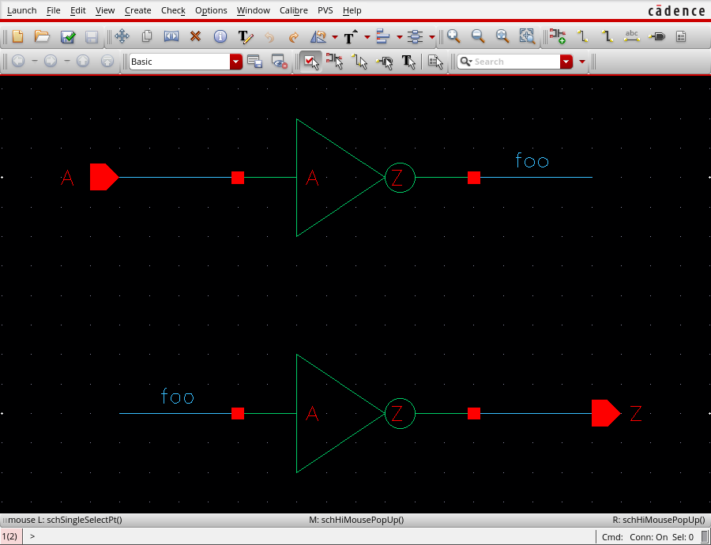
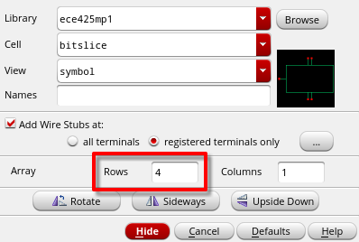
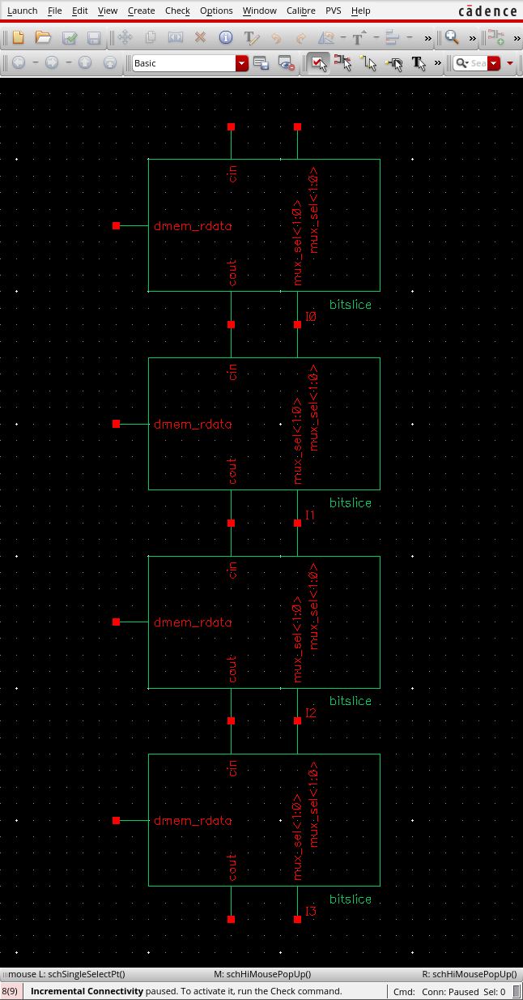
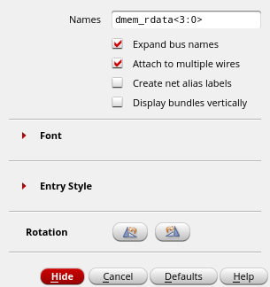
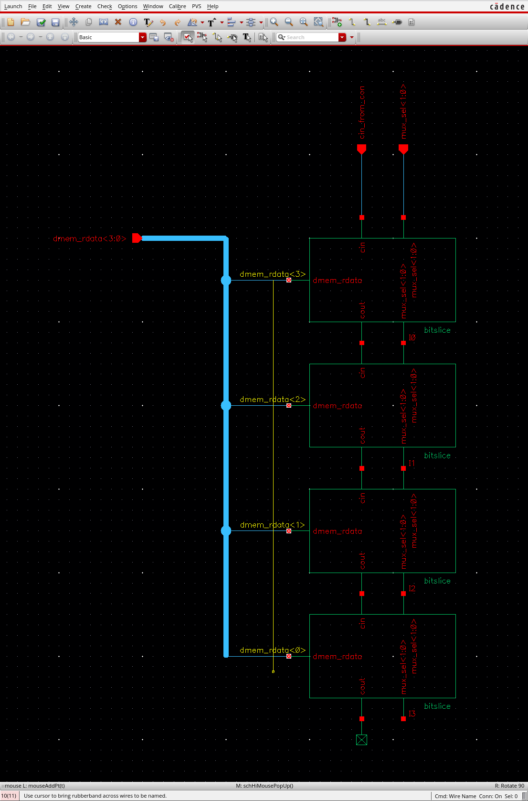
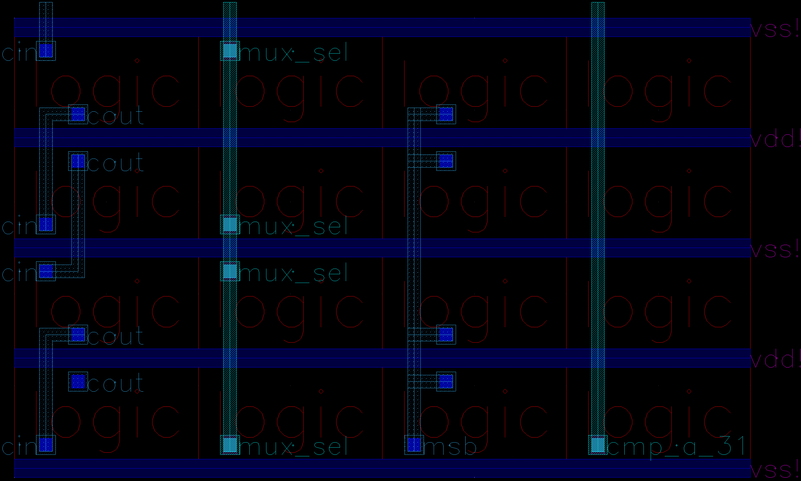

# ECE 425: mp_datapath GUIDE

**This document, GUIDE.md, serves as a gentle, guided tour of the MP. For strictly the specification and rubric, see [README.md](./README.md).**

# RISC-V

The specification for the RV32I ISA can be found here:
[The RISC-V Instruction Set Manual](https://drive.google.com/file/d/1uviu1nH-tScFfgrovvFCrj7Omv8tFtkp/view).

We provide the reference design, so you do not need to read this spec.
However, it is a good reference for any clarifications that we may have missed.

# What is a bitslice?

Before modern tools came about, engineers had to manually design everything.
For designs that had significant similarities between bits,
it was wise to design only one bit, then duplicate this single bit design to make a multi-bit design.
This is called a bitsliced design.

For example, the AM2901 was a popular 4-bit bitsliced processor.
Systems like the [VAX-11/730](https://en.wikipedia.org/wiki/VAX-11#VAX-11/730)
used 8 4-bit AM2901 chips to make a 32-bit computer, back in 1982!

Bitslicing can also be used within a single chip.
If you layout a 1-bit bitslice processor, you can stack 32 of them to make a 32-bit processor.

# Part 1: Schematic

You will need the schematic to completely work before you do the layout. Start here!

## Reference Design of a Bitslice

### The Bitslice

Orange lines will be explained in the datapath section.

#### Register File

You may have been told in the past that register files are made using D flip-flops.
While this can be true, it can be much more efficient to use a custom register file.

This will be the design we recommend you use:

This is the infamous write-on-low-clock read-on-high-clock register file design.
Each bit in the register file is written to when the clock is low, and the data is read out when the clock is high.

**Note that register 0 is hardwired to 0.**

#### Memory

This CPU is implemented as a Harvard architecture. This means the instructions and data use separate memory ports.

The memory responds on the same cycle that a request is given. The CPU never needs to wait for a response.

The addresses to both of these ports are byte-addresses. The width of the data that is written or read is always 32 bits.

##### Sign/Zero Extending

The RISC-V ISA supports loads at 8-bit (`lb`, `lbu`), 16-bit (`lh`, `lhu`), and 32-bit (`lw`) granularity.
The control unit figures out what kind of load it is, and sends select signals to your bitslice
to load either the bottom 8, bottom 16, or all 32 bits of the data.

When only the bottom 8 or 16 bits are read, the top bits are either zero-extended (`lbu`, `lhu`) or sign-extended (`lb`, `lh`).
For example, if an `lbu` instruction fetches the data `0x1234FFFF`, the register will load the value `0x000000FF`.
An `lb` would load the value `0xFFFFFFFF`.
The control unit handles this by sending a control signal to a mux that selects these possibilities.

#### PC

The PC is used for fetching instructions and for control-flow instructions (branches and jumps).
The PC register is *synchronously* reset to the starting instruction of your program.
For this MP, the PC should reset to `0x10000000`.

##### Synchronous vs Asynchronous Reset?

There are two options on how to approach resetting flip-flops:
- A synchronous reset means that the D flip-flop's value is initialized at the positive edge of a clock pulse when the reset signal is active.
- An asynchronous reset means that the D flip-flop's value is initialized whenever the reset signal is active, regardless of the clock.

A synchronous reset is easier to implement with your existing cells,
as it is just an additional 2-1 mux that selects the reset value or the input signal.
An asynchronous reset is useful in some circuits and can even save some area with a custom D flip-flop cell.

We recommend a synchronous reset for this MP.

#### Execution

##### Arithmetic

Input operands: `alu_mux_1_out`, `alu_mux_2_out`, `alu_cin`\
Control signals: `alu_sub`, `alu_op<1:0>`\
Outputs: `alu_cout`, `alu_out`

The arithmetic unit can perform `add`, `and`, `or`, and `xor` operations.

Note that `sub` is handled by inverting the subtrahend and setting the `cin` of the lsb (last/bottommost) adder to `1`.

##### Comparison Unit

Input operands: `rs1_rdata`, `cmp_mux_out`, `cmp_eq_in`, `cmp_lt_in`\
Outputs: `cmp_eq_out`, `cmp_lt_out`

All comparison operations in RISC-V can be done using two lines of comparison:
the equals check (`a == b`) and the less-than check (`a < b`).
Each result is cascaded from more significant to less significant bitslices.
The least significant bitslice then gives the result to the control unit,
which figures out the actual comparison result based on what the instruction requires.

Equals comparison logic: `cmp_eq_out = cmp_eq_in & (rs1_rdata ~^ cmp_mux_out)`
- True if the more significant bits were equal and the current sources are equal.

Less-than comparison logic: `cmp_lt_out = cmp_lt_in | (cmp_eq_in & (~rs1_rdata & cmp_mux_out))`
- True if the more significant bits were less or if the more significant bits were equal and the current `rs1_rdata < cmp_mux_out`.

To perform signed comparisons, the control unit also needs the most significant bit for the calculation. Specifically:
- Signed less-than comparison logic: `cmp_out = cmp_lt_out[0] ^ (cmp_src_a[31] ^ cmp_src_b[31])`
  - The signed result is the same as the unsigned result when both sources are positive or both are negative, and the result is inverted when the sources have opposite signs.

##### Shifter (Extra Credit)

Shown above is an illustration of an 8-bit left barrel shifter.

Input operands: `alu_mux_1_out`, `shift_amount<4:0>`, `shift_in_from_right<4:0>`, `shift_in_from_left<4:0>`\
Control signals: `shift_dir`\
Outputs: `shift_out<5>`, `shift_out<4:0>`

Each layer of a barrel shifter is responsible for a single shift by a power of 2.
Putting together multiple layers that shift 1, 2, 4, 8, and 16 allows the barrel shifter to shift any amount from 0 to 31.

In your design, if you choose to attempt this for extra credit,
you will need to support 32-bit logical left, logical right, and arithmetic right shifts.
Right shifts are done in a similar way to left shifts, just reversed.
Right shifts can be either arithmetic or logical. An arithmetic shift preserves the sign while a logical one shifts in 0s.
The control unit handles the choice between an arithmetic and logical right shift by outputting the signal `shift_msb`.

`shift_amount<4:0>` comes from the five least-significant bitslices. Each bit is connected to each corresponding bitslice's `alu_mux_2_out`.

### Datapath

The left side of the diagram illustrates how the carry bits should be routed between bitslices.
In addition, the controller only needs the highest bit for the comparison unit, so only `bitslice[31]` will have it routed to the controller.

The right side of the diagram illustrates how some of the signals vary from bitslice to bitslice.

Control signals are not shown, as they simply run vertically and connect to every bitslice.

## Schematic Tips and Tricks

### Connect by name

You can connect ports using wires with the same label.
This is functionally equivalent to drawing a wire between ports.

### Array of Instances

While instantiating an instance, you can choose to create an array of them:

Note that you can have a single port duplicated on the symbol. They are "internally" connected. This will help you connect control signals between bitslices.

### Bus

For multi-bit wires, you should create a wide wire (bus) instead of a narrow wire.

To tap a single bit from the bus, you can create a narrow wire and give it a label with a single bit index.

When creating labels, you can input a multi-bit label, select "Expand bus name" and "Attach to multiple wires", and the bus will be separated into individual labels and automatically attached to multiple wires.

Note that you can also have a space separated list of names, and "Attach to multiple wires" will work in the same way.

### Shorting two nets

Use cell `cds_thru` in library `basic` to connect two nets together.

## Custom Designs
When creating the standard cells in `mp_stdcell`, you were required to make all of your cells in a specific manner
to emulate the designs of actual standard cell libraries.
However, now that you are creating a custom processor manually,
these kind of restrictions matter less.
Instead, you are now much more concerned with minimizing your overall area.

This is why we recommend that in general, if you see an optimization, do it!

For example, many of your standard cells had various inverters
for complementary inputs or to invert the output. Don't be afraid to bubble push these away
or have a complementary signal come from the control unit (assuming you have the routing space).

If you're worried whether or not something is allowed,
remember that as long as you aren't putting logic into the control unit that needs to be replicated for each bitslice,
it's probably fine. If you are still worried about a particular optimization,
post a question on Campuswire or ask us during office hours.

## Simulation

We recommend using digital simulations to verify your schematic.
There are two provided folders: `reference` and `sim`.
Copy both folders into your extracted datapath netlist folder, following directions detailed in `mp_intro`.

`reference` contains the reference Verilog design for this processor.
<<<<<<< HEAD
<<<<<<< HEAD
To run the simulation, go inside `reference/sim` and run `make run_tb PROG=../testcode/base_test.s`.
This command analyzes the reference Verilog files, compiles the assembly file inside `reference/testcode/base_test.s`, and runs the processor.
=======
To run the simulation, go inside `reference/sim` and run `make run_tb PROG=../testcode/test.s`.
This command analyzes the reference Verilog files, compiles the assembly file inside `reference/testcode/test.s`, and runs the processor.
>>>>>>> f2b3c05 (release mp_datapath)
=======
To run the simulation, go inside `reference/sim` and run `make run_tb PROG=../testcode/base_test.s`.
This command analyzes the reference Verilog files, compiles the assembly file inside `reference/testcode/base_test.s`, and runs the processor.
>>>>>>> cfbd164 (smol patch)

`sim` contains very similar infrastructure to `reference`,
except that it will analyze your extracted schematic netlist of the datapath rather than the reference design.
Once your datapath is constructed,
run the same command as the reference design's inside `sim/sim/` and verify that the output matches the provided golden output.

<<<<<<< HEAD
<<<<<<< HEAD
=======

>>>>>>> f2b3c05 (release mp_datapath)
=======
>>>>>>> cfbd164 (smol patch)
We highly recommend testing smaller modules in your design before testing the overall bitslice,
as this will improve your debugging experience. Follow the instructions in `mp_intro` and write simple testbenches.

# Part 2: Layout

Make sure your schematic works before you spend too much time on the layout!

## Layout Tips and Tricks

### Standard Cells??

There is no limitation on how many rows of standard cells tall your bitslice can be.
We suggest you keep your bitslice within two rows.

One row gives you more vertical routing space, while two rows gives you more horizontal routing space.
Two rows can make custom register file design easier as well.

If you are using one row for each bitslice, you should flip every other bitslice vertically so that power rails of neighboring slices are shared.

### Control Signal Planning

The control unit will be placed above all of your bitslices.
This means that control signals will be routed vertically,
and all the bitslices will share the same control signal wires.
Therefore, when you create your layouts knowing that control signals come from above,
make sure that the same signal goes all the way across the bitslice so that the next bitslice can also be connected.

This rule also makes carry signals (adder carries, comparison lines, etc) very convenient to route.
For example, when a carry-in signal comes from the bottom, you should stop the signal inside the bitslice.
This allows the corresponding carry-out signal to then go out the top at the same horizontal position as the carry-in.

You may sometimes need signals going to the control unit or to other bitslices from only a specific set of bitslices.
For example, the control unit needs only the most significant bits of the comparison unit operands (`cmp_src_a[31]` and `cmp_src_b[31]`).
This will require a bit of manual connecting after putting together the datapath.
We recommend planning ahead for it by leaving space for vertical wires to connect to the bitslice when the datapath is assembled.

Here are some example cross bitslice connections in a single row bitslice design. Note that every other bitslice is flipped, as we recommended above.

### Layer Directions

As a physical designer, you want to avoid the issue of building a whole circuit only to find that you can't connect two cells together.
One rule to follow that helps avoid these issues is by predominantly using layers in their preferred directions.
We recommend the following routing directions:

- Horizontal: `metal2`, `metal4`, `metal6`
- Vertical: `metal3`, `metal5`
- Anywhere: `metal1`

You may also notice that some wires are thicker than others. Namely, the lower-numbered layers are thinner than the higher-numbered ones.
Therefore, try to keep the most routing-dense parts on the lower layers (metals 1-3),
so that your routing takes up as little space as possible.

### Floorplan

Once you create the schematic for the processor, you should start planning where certain modules will go in the bitslice.
This is called floorplanning. Many components will connect together, but unfortunately you are required to place everything in roughly one line so that you can stack up your bitslices efficiently.
Keep in mind that some signals may route across these modules, so leave some space inside a horizontal routing layer for them.
