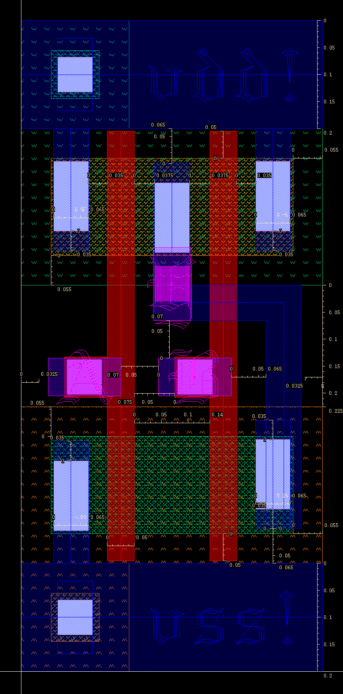
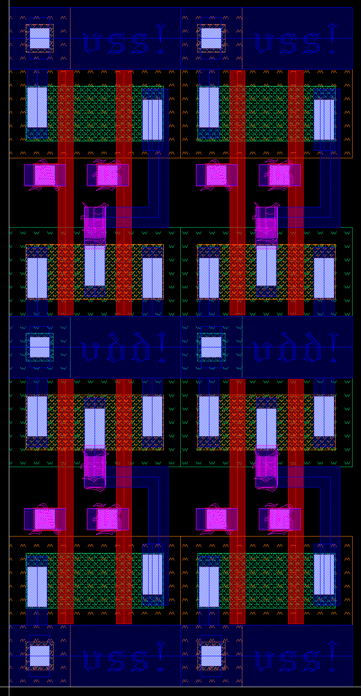
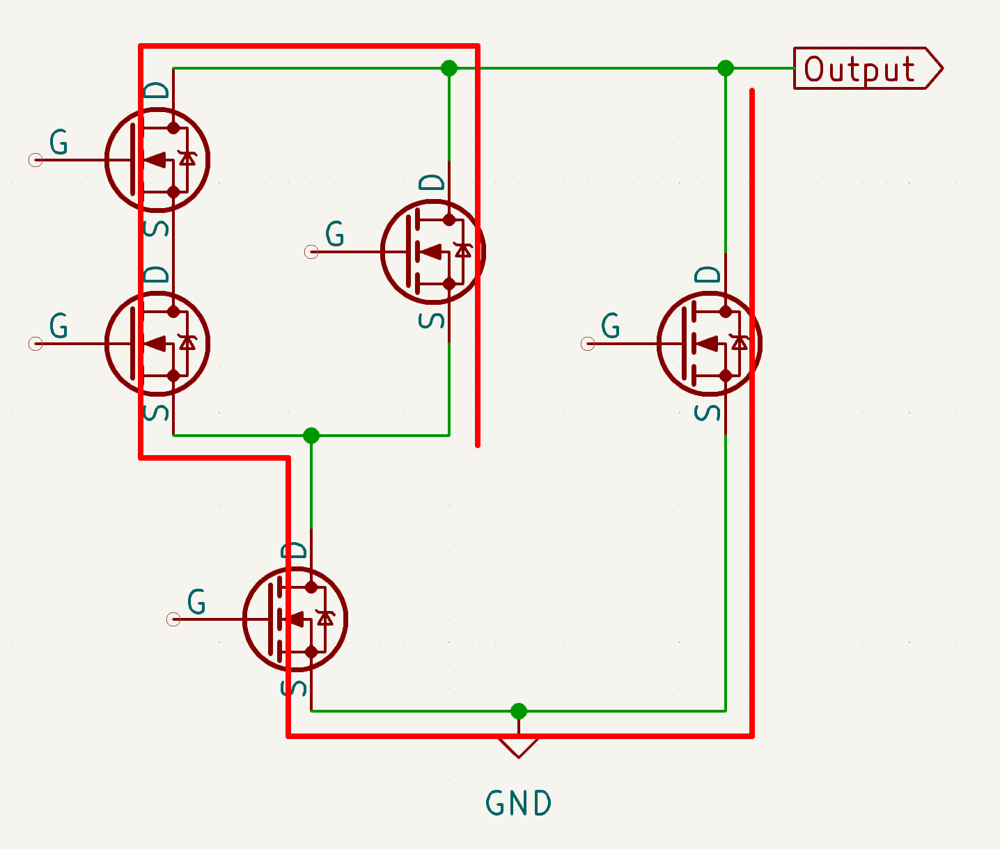

# ECE 425: mp_stdcell GUIDE

**This document, GUIDE.md, serves as a gentle, guided tour of the MP. For strictly the specifications and rubric, see [README.md](./README.md).**

# Example Cell

Here is an example screenshot of a clean and compact NAND2:



# In a Row?

The end goal of this MP is to leave you with cells that you can LEGO block together to form more complex designs,
hence the name standard cell. All standard cells should be able to fit together with no gaps,
have contiguous wells, and be of the same height. Here is an example of four such NAND2 cells in two rows:



The power rail size of 200nm is an arbitrary number we chose for this MP. In reality, they are usually thinner.

It is also worth mentioning that well taps are usually not included in logic cells,
rather they are their own standard cells that will be placed separately.
For this MP however, LVS will be displeased if your cells do not contain well taps.

# Source/Drain Merging

In the above example, you can see that the NMOS size is using a contiguous active/nimplant region,
and is thus 'missing' one of the drains and one of the sources of the series NMOS transistors. Since the active/nimplant region is conductive
and the middle terminal is not used, it is implied to be directly connected and so we can safely leave it out.

You can also see that the drains of the PMOS transistors are merged. Since they are in parallel,
we can choose either the source or the drain to be merged.
We cannot merge both as this would result in the gate being very hard to route.

A good technique to draw cells with as many merged sources/drains as possible is to try and trace all the (N-side)
transistors using one line without lifting your desired writing utensil. Here is an example:



You can then use stick diagrams to figure out the resultant connections for the PMOS side.

When there are multiple possible ways to trace, try to find the best path (the one that results in the most merged sources/drains).

# Transistor Sizing

Recall that the resistance of a material is proportional to its width and inversely proportional to its length.
Transistors in parallel are equivalent to a single transistor with their widths summed up,
while transistors in series are equivalent to a single transistor with their lengths summed up.

To ensure your cells have passable timing characteristics,
you should size your NMOS and PMOS transistors such that they have the desired resistance.
You should thus make sure that the worst case equivalent resistance from VDD to Z and VSS to Z is equal to a minimum size NMOS transistor.
The reason that we say worst case is because sometimes transistors can be in "parallel",
but they may or may not be active at the same time. Consider the PMOS transistors in NAND2,
where it could be the case that only one input is low at a time, or both inputs are low simultaneously.
The worst case here would be when only one input is low, so we size both PMOS transistors to be 180nm
so that either PMOS transtistor has the drive strength of a 90nm NMOS transistor.

# Latch and D-flip-flop

Here is the suggested schematic for a latch:


Here is the suggested schematic for a DFF:


These 2 schematics have adequate amounts of input/output buffering (to reduce fanout and provide good drive strength).
You are free to deviate from these schematics as long as they still function as intended.

It is recommended that you construct your DFF using two latches.

For the transmission gates used in your latches, make sure:
- The input is at the sources of both transistors and the output is at the drain of both transistors
- The input is of type `input` and the output is of type `tristate`

## Digital Simulation Shenanigans

When you are trying to do digital simulation on latch and dff, you should make sure to include delay on the `D` input
so that input will not change at the same time as clock, otherwise simulation might hang.

``` systemverilog
assign #1ps actual_d_input_to_dut = some_value;
```

# Tips for Compact and Clean Design

Poly should be used vertically for as much of your designs as possible.

Use a lot of rulers while drawing.

Draw the tallest cell first so you can use this height for other cells. If not, you may need to go back and resize old cells to be as tall as your new tallest cell.

Use metal 1 primarily vertically, and metal 2 primarily horizontally.

Have `/class/ece425/FreePDK45/ncsu_basekit/techfile/calibre/calibreDRC.rul` open on the side so you can check the DRC rules while you draw.
